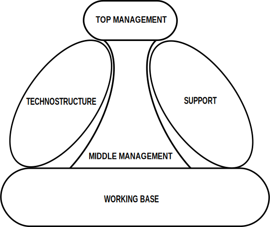

<!-- README.md is generated from README.Rmd. Please edit that file -->

# Mintzberg

This package aims a producing Mintzberg chart



Mintzberg chart allows to visualise what implicit decision are being
made when designing an organisational structure.

The main [successful organizational
structures](https://www.mindtools.com/pages/article/newSTR_54.htm) that
can be identified are as follows:

  - The entrepreneurial organization.
      - *Prime Coordinating Mechanism:* Direct supervision  
      - *Key Part of Organization:* Strategic apex  
      - *Type of Decentralization:* Vertical and horizontal
        decentralization
  - The machine organization (bureaucracy).
      - *Prime Coordinating Mechanism:* Standardization of work
        processes
      - *Key Part of Organization:* Technostructure  
      - *Type of Decentralization:* Limited horizontal decentralization
  - The professional organization.
      - *Prime Coordinating Mechanism:* Standardization of skills  
      - *Key Part of Organization:* Operating core  
      - *Type of Decentralization:* Vertical and horizontal
        decentralization
  - The divisional (diversified) organization.
      - *Prime Coordinating Mechanism:* Standardization of outputs  
      - *Key Part of Organization:* Middle line  
      - *Type of Decentralization:* Limited vertical decentralization
  - The innovative organization (“adhocracy”).
      - *Prime Coordinating Mechanism:* Mutual adjustment  
      - *Key Part of Organization:* Support staff  
      - *Type of Decentralization:* Selective decentralization

In order to detect the [above
structure](https://platform.europeanmoocs.eu/users/8/Lunenburg-Fred-C.-Organizational-Structure-Mintzberg-Framework-IJSAID-V14-N1-2012.pdf),
staff functions need first to be grouped according to the following
categories:

  - The **strategic apex** is top management and its support staff. In
    school districts, this is the superintendent of schools and the
    administrative cabinet.

  - The **operative core** are the workers who actually carry out the
    organization’s tasks. Teachers constitute the operative core in
    school districts.

  - The **middle line** is middle-and lower-level management. Principals
    are the middle-level managers in school districts.

  - The **technostructure** are analysts such as engineers, accountants,
    planners, researchers, and personnel managers. In school districts,
    divisions such as instruction, business, personnel, public
    relations, research and development, and the like constitute the
    technostructure.

  - The **support staff** are the people who provide indirect services.
    In school districts, similar services include maintenance, clerical,
    food service, busing, legal counsel, and consulting to provide
    support.

## Installation

You can install `IatiTidy` from GitHub with:

``` r
# install.packages("devtools")
devtools::install_github("Edouard-Legoupil/Mintzberg")
```

Users are welcome to flag bugs and or submit feature request
[here](https://github.com/Edouard-Legoupil/Mintzberg/issues/new)

#### Building package documentation

`devtools::document()`

`devtools::check(document = FALSE)`

`pkgdown::build_site()`

## Usage

see vignette
